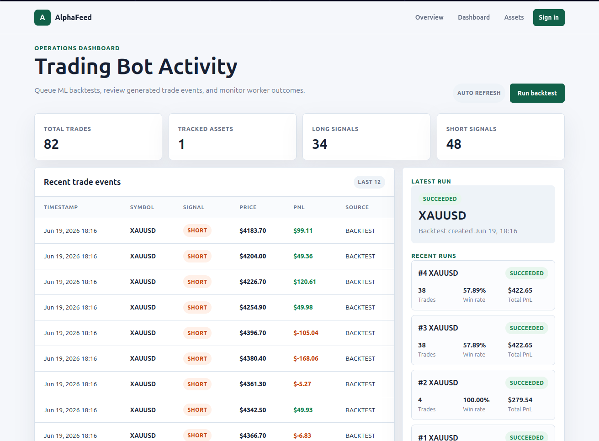

# AlphaFeed

AlphaFeed is a robust Django-based SaaS platform designed for gold trading research, signal scanning, and ML-driven backtesting. The architecture leverages a distributed task queue system to handle asynchronous research tasks independently of the web interface.

## Tech Stack
* **Web Framework:** Django
* **Task Queue:** Celery
* **Message Broker:** Redis
* **Database:** PostgreSQL (Production) / SQLite (Local)

---

## Local Development Setup

1.  **Environment Setup:**
    ```bash
    python3 -m venv .venv
    source .venv/bin/activate
    pip install -r requirements.txt
    ```

2.  **Configuration:**
    Copy the example environment file and configure your local settings:
    ```bash
    cp alphaFeed/.env.example alphaFeed/.env
    ```

3.  **Database Initialization:**
    ```bash
    python alphaFeed/manage.py migrate
    python alphaFeed/manage.py createsuperuser
    ```

4.  **Running the Services:**
    You will need three separate terminal sessions:
    * **Web Server:** `python alphaFeed/manage.py runserver 127.0.0.1:8000`
    * **Worker:** `python -m celery -A alphaFeed worker --loglevel=info`
    * **Scheduler:** `python -m celery -A alphaFeed beat --loglevel=info`

---

## Production Checklist

Before deploying to a live environment, ensure the following steps are completed:

* **Security:** Set `DJANGO_DEBUG=False` and rotate your `DJANGO_SECRET_KEY`.
* **Host Configuration:** Configure `ALLOWED_HOSTS` and `CSRF_TRUSTED_ORIGINS` to match your domain.
* **Database & Broker:** Transition from SQLite to a managed PostgreSQL instance and a secured Redis instance.
* **Static Assets:** Run `python alphaFeed/manage.py collectstatic --noinput` during your deployment pipeline.
* **Reverse Proxy:** Serve the application using Gunicorn behind an Nginx HTTPS reverse proxy.
* **Environment Variables:** Ensure `alphaFeed/.env` is excluded from version control. Use `.env.example` as a template for environment configuration.
* **Broker Safety:** The current implementation is strictly for research and backtesting. **Do not enable live order placement** until a hardened broker adapter has been integrated and audited.

---

## Process Commands (Deployment)

For production environments, run the services using the following patterns:

| Process | Command |
| :--- | :--- |
| **Web** | `gunicorn alphaFeed.wsgi:application --chdir alphaFeed --bind 0.0.0.0:8000` |
| **Worker** | `celery -A alphaFeed worker -l info --workdir alphaFeed` |
| **Scheduler**| `celery -A alphaFeed beat -l info --workdir alphaFeed` |

---

## Architecture Overview


This system uses a decoupled architecture to ensure that heavy signal processing and backtesting computations do not interfere with dashboard responsiveness. The **Beat** process acts as the system clock, the **Redis Broker** manages the queue, and the **Celery Workers** provide the parallel processing power required for high-frequency market research.
